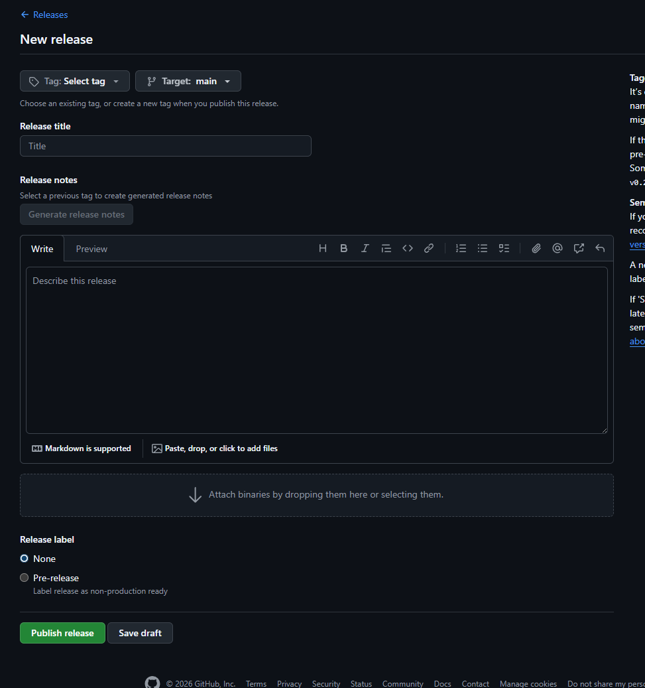

# PiggieTV Android

PiggieTV Android is a branded native Android client for PiggieTV, built from the Jellyfin Android codebase and customized to feel like a first-party PiggieTV app.

The app auto-connects to PiggieTV, uses PiggieTV artwork and colors, and replaces the generic Jellyfin home experience with native screens, native rows, native media details, and a PiggieTV-styled playback interface.

## What This App Does

- Connects to `https://piggietv.com` by default.
- Uses PiggieTV branding, splash assets, icons, gradients, login UI, and playback controls.
- Provides a native home screen driven by PiggieTV row logic.
- Shows native media details when tapping a title; playback starts from the explicit play button.
- Supports movies, shows, episodes, music albums, playlists, and audio playback.
- Includes a Requests tab for Jellyseerr at `https://request.piggietv.com`.
- Includes a native Library tab for Calibre-Web/Autocaliweb OPDS at `https://books.piggietv.com/opds`.
- Includes signup through JFA-Go at the PiggieTV invite URL.
- Includes a Discord shortcut on the login screen.
- Adds admin dashboard access for administrator users.
- Adds media reporting from home/details/playback with predefined issue types and custom reports.
- Scales for phones, foldables, and tablets.

## Current PiggieTV Features

- Native PiggieTV login screen with signup and Discord actions.
- Fast progressive native home loading so the app becomes usable before every row finishes.
- PiggieTV row groups for home, continue watching, latest media, genres, franchises, libraries, and music.
- Random title button that plays a random playable movie, episode, or video.
- Scroll-aware header that hides while browsing and reappears at the top.
- Native details screen for media cards.
- PTV-styled native playback UI, including report action and gradient icon assets.
- Music playback support through the native player.
- Native Library tab with OPDS book grids, cover cards, book details, download actions, and in-app reading.
- Secure Library credentials stored with Android encrypted storage.
- Protected Library OPDS feeds and cover images support Basic Auth/session cookies.
- Library loading is optimized for phones, foldables, and tablets by showing books before slower optional OPDS metadata finishes.
- Sign out returns to the PiggieTV login screen instead of server selection.

## Library

The Library tab integrates with Calibre-Web or Autocaliweb through OPDS. It does not use a WebView.

- Primary server: `https://books.piggietv.com`
- OPDS catalog: `https://books.piggietv.com/opds`
- Native book lists for recent/all books.
- Native book detail screen with authors, categories/series when available, cover art, read links, and download links.
- In-app reader for supported book formats, including PDF, EPUB text extraction, plain text, and CBZ/image ZIP pages.
- Reader prepares the first pages first and continues rendering ahead while reading.
- Library username/password can be saved in Settings and are stored securely.
- HTTP 401 is treated as Library login required.
- OPDS loading now tries smaller feeds first and uses longer OPDS-specific timeouts to avoid false timeout errors on real devices.
- Cover loading prefers OPDS thumbnail images when available.

If Calibre-Web requires authentication, enable OPDS in Calibre-Web and save the Library username/password in PiggieTV Settings.

## PiggieTV Endpoints

These are configured in `app/src/main/java/org/jellyfin/mobile/utils/Constants.kt`.

- Default server: `https://piggietv.com`
- Testing server: `https://testing.piggietv.com`
- Requests: `https://request.piggietv.com`
- Library: `https://books.piggietv.com`
- Library OPDS: `https://books.piggietv.com/opds`
- Signup: `https://signup.piggietv.com/invite/ysBDoDSMpv5fFMz9GPMxUL`
- Discord: `https://discord.gg/FbtexGYau`

## Recent Fixes And Enhancements

- Fixed saving Library credentials from Settings so the username appears after Save and the password shows `Saved securely`.
- Fixed protected Library covers by routing Coil image requests through the authenticated OkHttp client.
- Fixed OPDS URI-template links such as `/opds/search/{searchTerm}` being treated as real paths.
- Improved Library loading on physical devices by removing a short global network timeout and using OPDS-specific timeouts.
- Improved Library startup by loading the first available book feed before optional authors, series, and category metadata.
- Added fallback handling for Calibre-Web OPDS download links when equivalent direct download routes are available.
- Added native Library reader support instead of handing everything off to download-only flows.

## Build Requirements

- Android Studio
- Android SDK
- Java runtime from Android Studio JBR or another compatible JDK

## Build

From the repo root:

```powershell
$env:JAVA_HOME='C:\Program Files\Android\Android Studio\jbr'
$env:PATH="$env:JAVA_HOME\bin;$env:PATH"
.\gradlew.bat assembleProprietaryDebug
```

On macOS/Linux:

```sh
./gradlew assembleProprietaryDebug
```

The generated debug APK is written under:

```text
app/build/outputs/apk/proprietary/debug/
```

## Install To Device

```powershell
$env:JAVA_HOME='C:\Program Files\Android\Android Studio\jbr'
$env:PATH="$env:JAVA_HOME\bin;$env:PATH"
.\gradlew.bat installProprietaryDebug
```

## Flavors

This project still inherits Jellyfin Android build flavors:

- `proprietary`: includes Google Chromecast support.
- `libre`: excludes proprietary Chromecast support.

PiggieTV development has primarily used:

```text
assembleProprietaryDebug
```

## Security Notes

Media reports currently post to the configured Discord reporting integration from the app. Treat any webhook or integration URL as sensitive; rotate it if it is exposed outside trusted development channels.

## Upstream Attribution

PiggieTV Android is based on Jellyfin for Android. Jellyfin is a free software media system, and this repository retains the upstream GPL-2.0 license terms in `LICENSE.md`.

Upstream project:

```text
https://github.com/jellyfin/jellyfin-android
```

PiggieTV-specific UI, branding, default server behavior, request/signup integration, Library integration, media reporting, and native home/playback changes are maintained in this repository.


